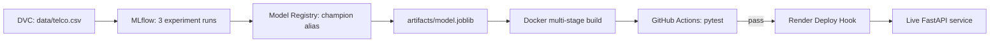

# Churn Prediction API

Production-grade ML service: XGBoost churn model served via FastAPI, tracked with MLflow, data versioned with DVC, containerized with Docker, deployed on Render with a GitHub Actions CI/CD gate.

**Live demo:** https://churn-api-xxxx.onrender.com/docs

## Architecture



## Endpoints

| Method | Path | Purpose |
|---|---|---|
| GET | `/health` | Liveness check |
| GET | `/model-info` | Model version, threshold, offline metrics |
| GET | `/metrics` | Runtime request counters |
| POST | `/predict` | Single customer prediction |
| POST | `/predict/batch` | Batch prediction (up to 1000) |
| GET | `/docs` | Swagger UI |

## Model performance (held-out test set)

| Metric | Value |
|---|---|
| ROC-AUC | 0.8471 |
| PR-AUC | 0.6643 |
| Recall | 0.7701 |
| Precision | 0.5294 |

## Run locally

```bash
pip install -r requirements.txt
uvicorn app.main:app --reload
```

## Run tests

```bash
pip install -r requirements.txt -r requirements-test.txt
pytest tests -v
```

## Engineering notes

- Model is baked into the Docker image (`from_local`) for deployment reproducibility; an MLflow Registry mode (`from_env` → `from_registry`) also exists for environments with a persistent tracking backend.
- CI/CD gate: GitHub Actions runs `pytest` on every push; only a passing run triggers Render's Deploy Hook (Render auto-deploy is disabled).
- `$PORT` is read dynamically in the container entrypoint for platform portability (tested across GCP Cloud Run, Hugging Face Spaces, and Render).
